# Docker Networking Deep Dive
Docker networking is a fascinating topic. When one knows how to use Docker, then knowing it's networking and other internals helps even more. 

In this document, I have explained: 
* different networking modes available in docker, 
* the mechanisms of service discovery, 
* and procedure to join containers to each other for troubleshooting.

**Note:** The examples are from a docker host running **Fedora Linux 31**, and **Docker Engine 19.03.8** . 

The following networks are available to you *by default*, when you install docker on your computer.
* Bridge - NAT - docker0
* Host - Uses host network
* None - Isolated / no networking

Other Docker networks available to you are the following, but are *not* covered in this document.
* Overlay - Swarm mode
* Macvlan - Legacy applications needing direct connection to physical network
* 3rd party network plugins


**Note:** In case you are wondering, in very simple terms, **a software bridge is just another name for a (software) network switch!**


## docker0 - The default "Bridge" network

```
dockerhost ~]$ docker network ls

NETWORK ID          NAME                DRIVER              SCOPE
ab382bcb8342        bridge              bridge              local
c46f23496264        host                host                local
2c77e24c2352        none                null                local
```
Here is how the default bridge network looks like:

| 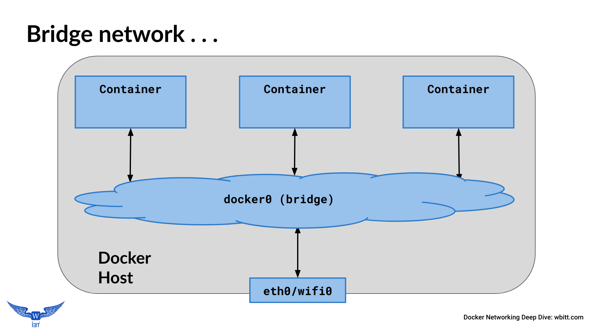 |
| ------------------------------------------------------------------------- |

Another way to look at the default bridge network:

| 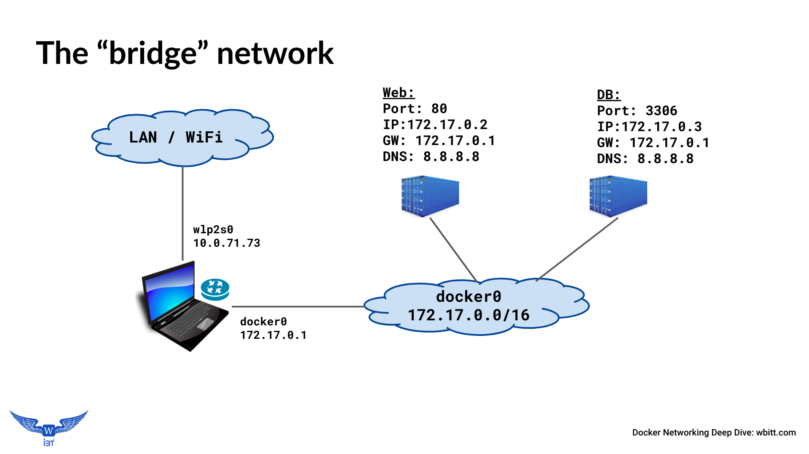 |
| ------------------------------------------------------------------------- |

**Important points:**
* By default, all containers are connected to the default bridge network, unless explicitly configured to connect to some other network.
* Containers talk to the docker host and outside world (`ip_forward=1` and NAT) 
* Docker host can talk to all containers using their IP addresses
* The (default) bridge network (interface) is visible/available on the host computer as `docker0`.
* At start up, Docker engine finds an unused network subnet on the docker host (normally `172.17.0.0/16`), and assigns the first IP address of that network (normally  `172.17.0.1`) to the default bridge - `docker0`.
* There is **no service discovery** on default bridge.

Lets look at network interfaces on the host computer:
```
dockerhost ~]$ ip addr show
. . .  
1: lo: <LOOPBACK,UP,LOWER_UP> mtu 65536 qdisc noqueue . . . 
    inet 127.0.0.1/8 scope host lo
. . . 
2: wlp2s0: <BROADCAST,MULTICAST,UP,LOWER_UP> ... state UP . . . 
    inet 10.10.71.73/24 brd 10.10.71.255 scope global dynamic wlp2s0
. . . 
9: docker0: <NO-CARRIER,BROADCAST,MULTICAST,UP> ... state DOWN  . . . 
    inet 172.17.0.1/16 brd 172.17.255.255 scope global docker0

```
**Note:** `state` is *DOWN* when there are no running containers attached to this network interface/bridge.

Run two containers, which will automatically be connected to the default bridge:
```
dockerhost ~]$ docker run --name web \
                 -d praqma/network-multitool

dockerhost ~]$ docker run --name db \
                 -e MYSQL_ROOT_PASSWORD=secret \
                 -d mysql


dockerhost ~]$ docker ps
CONTAINER ID	 IMAGE                    COMMAND                 PORTS   NAMES
8eaf8debb553  mysql                     "docker-entrypoint.s…"  3306    db
8c3f594512b1  praqma/network-multitool  "nginx -g 'daemon of…"  80/tcp  web
```

Inspect the bridge:
```
dockerhost ~]$ docker network inspect bridge
. . . 
        "Containers": {
            "8c3f594512b1...": {
                "Name": "web",
                "EndpointID": "ca36034a9eb1...",
                "MacAddress": "02:42:ac:11:00:02",
                "IPv4Address": "172.17.0.2/16",
            },
            "8eaf8debb553...": {
                "Name": "db",
                "EndpointID": "3158ac7dee51...",
                "MacAddress": "02:42:ac:11:00:03",
                "IPv4Address": "172.17.0.3/16",
            }
. . . 
"com.docker.network.bridge.name": "docker0",
```

### The `veth` interfaces on bridge networks:

When containers are run and connected to bridge networks, a pair of network sockets is created. One is assigned to the container as `eth0`, and the other is assigned/connected to the bridge as `vethX`, where *X* is a random string.
```
dockerhost $ ip addr show
. . . 
9: docker0: <... UP,LOWER_UP> ... state UP
    link/ether 02:42:37:9e:00:f6 brd ff:ff:ff:ff:ff:ff
    inet 172.17.0.1/16 brd 172.17.255.255 scope global docker0
. . .
11: veth229dc64@if10: <... UP,LOWER_UP> . . . master docker0 state UP 
    link/ether 2e:a8:cc:3b:78:09 brd ff:ff:ff:ff:ff:ff link-netnsid 0
. . .
13: veth18066aa@if12: <... UP,LOWER_UP> . . . master docker0 state UP 
    link/ether 52:83:73:27:cf:e3 brd ff:ff:ff:ff:ff:ff link-netnsid 1
. . . 
```

| 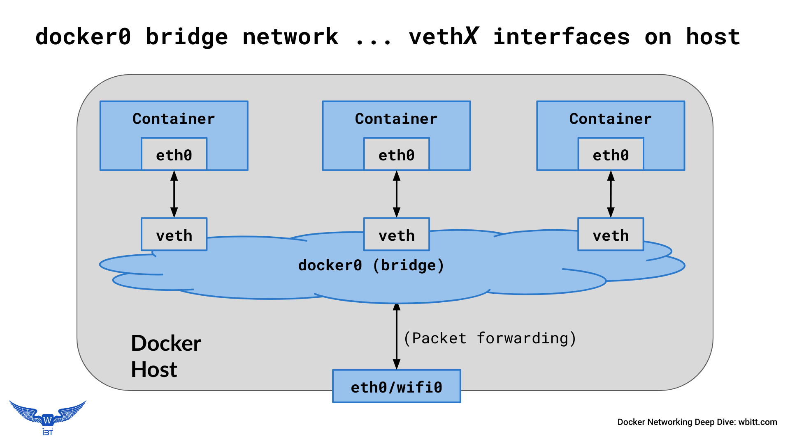 |
| ----------------------------------------------------------------------------------- |


| 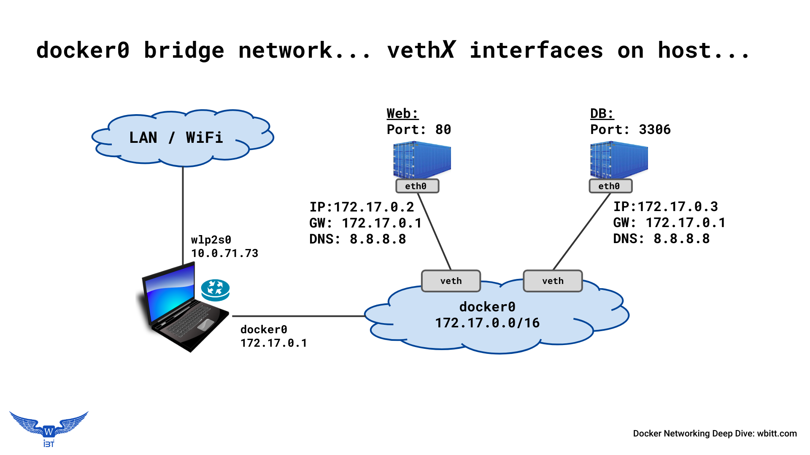 |
| ----------------------------------------------------------------------------------- |

### Inspect containers connected to the bridge network:

```
dockerhost$ docker inspect web | egrep "MacAddress|IPAddress"
                    "IPAddress": "172.17.0.2",
                    "MacAddress": "02:42:ac:11:00:02",

dockerhost$ docker inspect db | egrep "MacAddress|IPAddress"
                    "IPAddress": "172.17.0.3",
                    "MacAddress": "02:42:ac:11:00:03",
```

```
dockerhost$ docker exec web ip addr show
. . . 
10: eth0@if11: <...UP,LOWER_UP> . . . state UP . . .
    link/ether 02:42:ac:11:00:02 brd ff:ff:ff:ff:ff:ff link-netnsid 0
    inet 172.17.0.2/16 brd 172.17.255.255 scope global eth0
```
Notice that the IP and MAC of the `web` container as shown in the `docker inspect` command is same as found in the output of the `docker exec` command. 


### Communication on the default docker0 bridge:

* The container inherits the DNS setting of the docker daemon (from the host), including the `/etc/hosts` and `/etc/resolv.conf`
* There is **no service discovery** on the default bridge
* Since there is no service discovery, containers must know IP of each other to be able to talk to each other, unless you use ‘--link’ ; that is not scalable beyond 2-3 containers, and is deprecated
* Trying to find IP address of the other containers is complicated
* All ports of a container are exposed to all other containers on the same bridge network. No ports are published on the host by default
* Publishing  container ports to the host involves keeping track of which container publishes which port on the host.


Communication on default docker0 bridge in action:
```
dockerhost ~]$ docker exec -it web /bin/sh

/ # ping db
ping: db: Name does not resolve

/ # ping 172.17.0.3
PING 172.17.0.3 (172.17.0.3) 56(84) bytes of data.
64 bytes from 172.17.0.3: icmp_seq=1 ttl=64 time=0.154 ms

# telnet 172.17.0.3 3306
J
8.0.1Z	7lQ.	�L]VP7}Q:T,caching_sha2_password
^]
/ #
```


## "User-defined" bridge network:
Users can create their own docker network. It has certain advantages, most importantly *service discovery*.

| 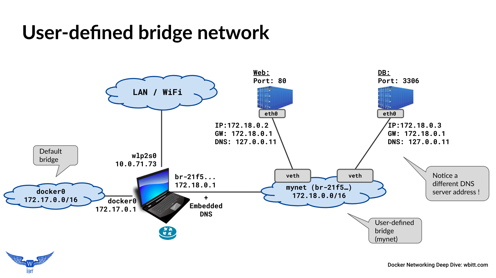| 
| ---------------------------------------------------------------------------------------------- |

Create a bridge network:
```
dockerhost ~]$ docker network create mynet

dockerhost ~]$ docker network ls
NETWORK ID          NAME                DRIVER              SCOPE
c0a96220208b        bridge              bridge              local
c46f23496264        host                host                local
b63ec54532ae        mynet               bridge              local
2c77e24c2352        none                null                local

dockerhost ~]$ docker network inspect mynet
. . .
"Subnet": "172.18.0.0/16",
    "Gateway": "172.18.0.1"
. . . 
```
It should show up as a network interface on the host with the name `br-<random-string>` .
```
dockerhost ~]$ ip addr show
. . . 
9: docker0: <...MULTICAST,UP> ... state DOWN ... 
    link/ether 02:42:37:9e:00:f6 brd ff:ff:ff:ff:ff:ff
    inet 172.17.0.1/16 brd 172.17.255.255 scope global ...
. . . 
14: br-b63ec54532ae: <...MULTICAST,UP> ... state DOWN ...
    link/ether 02:42:ae:c2:65:74 brd ff:ff:ff:ff:ff:ff
    inet 172.18.0.1/16 brd 172.18.255.255 scope global ...

. . . 
```
Notice the ID of the "mynet" bridge is "br-b63e...". 

Now run two containers and connect them on this network you created just now:
```
dockerhost ~]$ docker run --name=web --network=mynet \
             -d praqma/network-multitool

dockerhost ~]$ docker run --name=db --network=mynet \
             -e MYSQL_ROOT_PASSWORD=secret \
             -d mysql

$ docker ps
CONTAINER ID  IMAGE                     COMMAND                 PORTS     NAMES
34f8f56fe8b2  mysql                     "docker-entrypoint.s…"  3306/tcp  db
1d480f66ce00  praqma/network-multitool  "nginx -g 'daemon of…"  80/tcp    web
```

Inspect the network:
```
dockerhost ~]$ docker network inspect mynet
. . .
        "Name": "mynet",
                    "Subnet": "172.18.0.0/16",
                    "Gateway": "172.18.0.1"
. . . 
                "Name": "web",
                "MacAddress": "02:42:ac:12:00:02",
                "IPv4Address": "172.18.0.2/16",
. . . 
                "Name": "db",
                "MacAddress": "02:42:ac:12:00:03",
                "IPv4Address": "172.18.0.3/16",
```
Notice that the containers connected to the `mynet` show up in the output when the network "mynet" is inspected.

### Service Discovery on user-defined bridge:
**There is (DNS based) service discovery** on user-defined bridge. How it works? and how it looks like? - is explained next.

`exec` into a container connected to the network you created just now. Notice that it can resolve the names of the other containers on the same network.
```
dockerhost ~]$ docker exec -it web /bin/sh

/ # ping -c 1 db 
PING db (172.18.0.3) 56(84) bytes of data.
64 bytes from db.mynet (172.18.0.3): icmp_seq=1 ttl=64 time=0.084 ms

/ # ping -c 1 yahoo.com
PING yahoo.com (72.30.35.10) 56(84) bytes of data.
64 bytes from media-router-fp2.prod1.media.vip.bf1.yahoo.com (72.30.35.10): icmp_seq=1 ttl=52 time=165 ms

/ # dig +short yahoo.com
98.137.246.8
72.30.35.10
. . . 
```

Above works, because there is an **embedded DNS** in the docker service on the host computer. It is explained below.
 
| 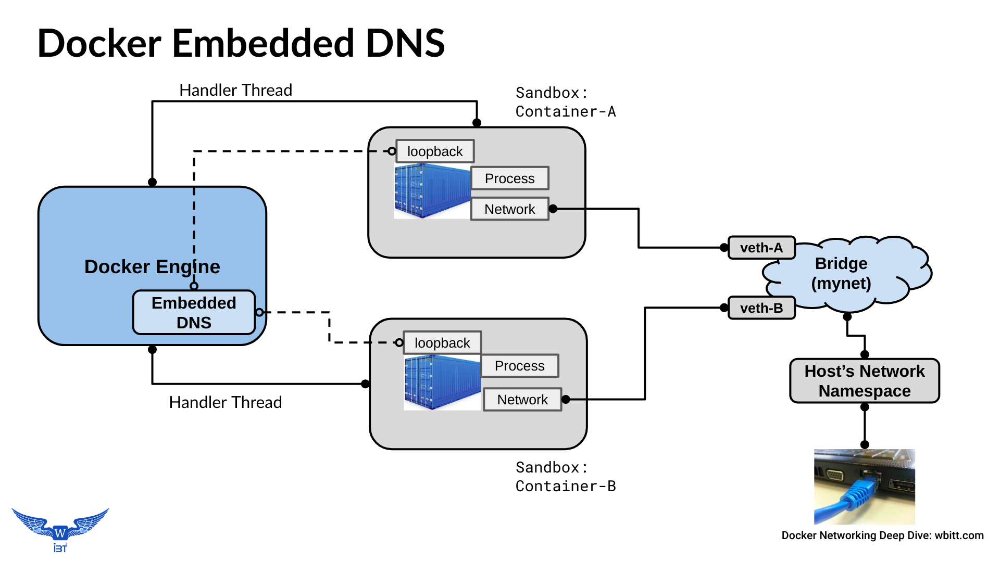 |
| ------------------------------------------------------------------------------- |

`exec` into a container connected to `mynet`, and do some investigation.
```
dockerhost ~]$ docker exec web cat /etc/resolv.conf
search home.wbitt.com
nameserver 127.0.0.11
options ndots:0

dockerhost ~]$ docker exec db cat /etc/resolv.conf
search home.wbitt.com
nameserver 127.0.0.11
options ndots:0

dockerhost ~]$ docker exec web netstat -antup
Active Internet connections (servers and established)
Proto Recv-Q Send-Q Local Address     Foreign Address   State       PID/Program
tcp        0      0 127.0.0.11:40521  0.0.0.0:*         LISTEN      -
tcp        0      0 0.0.0.0:80        0.0.0.0:*         LISTEN      1/nginx
udp        0      0 127.0.0.11:38657  0.0.0.0:*                     -
```

The `/etc/resolv.conf` says that the DNS is available at `127.0.0.11`, and on port `53`, which is implied. But, the `netstat` output does not show any process listening on port `53`, neither on TCP, nor UDP. So where is the DNS server?

Let’s add a *tools* container to "mynet", to look under the hood. We need some extra *CAP-abilities* for our container being used for investigation.

```
$dockerhost ~] docker run \
                  --name multitool \
                  --network mynet \
                  --cap-add=NET_ADMIN \
                  --cap-add=NET_RAW \
                  -it praqma/network-multitool /bin/bash

bash-5.0# ping -c 1 db
PING db (172.18.0.3) 56(84) bytes of data.
64 bytes from db.mynet (172.18.0.3): icmp_seq=1 ttl=64 time=0.074 ms

bash-5.0# dig db
;; QUESTION SECTION:
;db.        IN    A

;; ANSWER SECTION:
db.     600	IN    A   172.18.0.3

;; SERVER: 127.0.0.11#53(127.0.0.11)
```
Notice the DNS server responding to our DNS queries is: `127.0.0.11#53` , but we don't see a process running on port `53` in this container! So what is going on here?

Check netstat output on this *tools* container:
```
bash-5.0# netstat -ntlup
Active Internet connections (only servers)
Proto Recv-Q Send-Q Local Address       Foreign Address     State      PID/Program
tcp        0      0 127.0.0.11:37553    0.0.0.0:*           LISTEN     -  
udp        0      0 127.0.0.11:35464    0.0.0.0:*                      - 
```
**Observations:**
* The ports `37553` and `35464` do not look like DNS server ports! So what are these?
* Why these processes inside the container do not have PIDs?


Answer to all DNS mystery - **IPTables magic!**

Check the iptables rules in the tools container:
```
bash-5.0# iptables-save 
*nat
:PREROUTING ACCEPT [18:2796]
:INPUT ACCEPT [0:0]
:OUTPUT ACCEPT [4:171]
:POSTROUTING ACCEPT [9:502]
:DOCKER_OUTPUT - [0:0]
:DOCKER_POSTROUTING - [0:0]
-A OUTPUT -d 127.0.0.11/32 -j DOCKER_OUTPUT
-A POSTROUTING -d 127.0.0.11/32 -j DOCKER_POSTROUTING

# Queries for DNS:
-A DOCKER_OUTPUT -d 127.0.0.11/32 -p tcp -m tcp --dport 53 -j DNAT --to-destination 127.0.0.11:37553
-A DOCKER_OUTPUT -d 127.0.0.11/32 -p udp -m udp --dport 53 -j DNAT --to-destination 127.0.0.11:35464

# Response from DNS:
-A DOCKER_POSTROUTING -s 127.0.0.11/32 -p tcp -m tcp --sport 37553 -j SNAT --to-source :53
-A DOCKER_POSTROUTING -s 127.0.0.11/32 -p udp -m udp --sport 35464 -j SNAT --to-source :53
```
**Explanation:**
From the `iptables` rules, we learn that any (DNS query) traffic looking for `127.0.0.11:53` is actually redirected to `127.0.0.11:37553` (for TCP), and to `127.0.0.11:35464` (for UDP). 

There is a docker process running on these ports inside the container, which are actually docker's embedded DNS's hooks. When anything is sent on these hooks, docker's embedded DNS responds with the results of the query.

The last two `iptables` rules show that when the results/return DNS traffic is received from these two special ports (or processes), they are changed back (SNAT - Source Network Address Translation) to the same IP address but with port 53 as source port. For the innocent `dig` or `nslookup` commands, the query went to `127.0.0.11:53` and results came back from the same. This is the story! Below is the diagram, which should help make sense of all of this explanation.
 
| 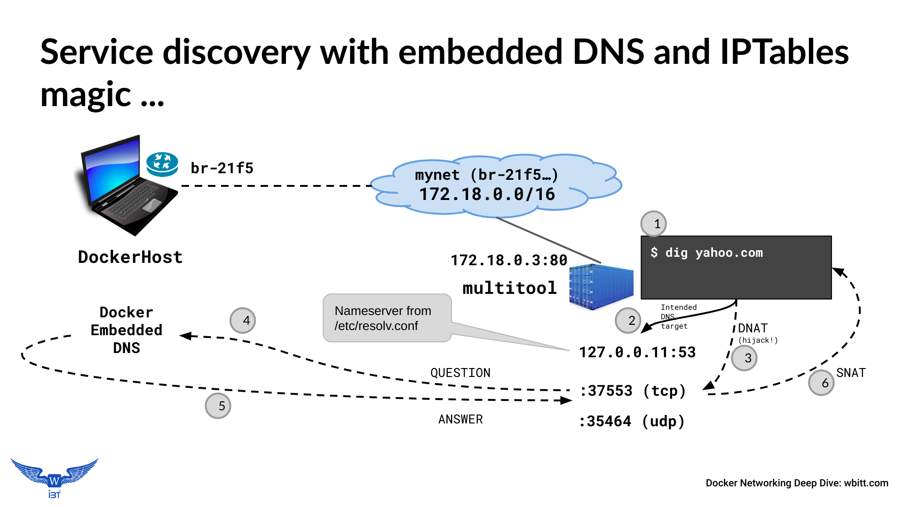 |
| ------------------------------------------------------------------------------- |

**Notes:**
* Above (`iptables` command) won't work without adding certain CAP-abilities to the container at run time. That is why we used the extra CAP-abilities: `--cap-add=NET_ADMIN` and `--cap-add=NET_RAW`
* By default, DNS uses UDP for queries less than 512 bytes. It switches to TCP for queries larger than 512 bytes. UDP is faster, simpler and lighter.


## "Compose-defined" bridge network:

This is exactly the same as *user-defined* bridge, except `docker-compose` creates it automatically, when you bring up a `docker-compose` based application stack.

Here is a simple `docker-compose` application stack:
```
simpleweb]$ cat docker-compose.yml 
version: "3"
services:
  apache:
    image: httpd:alpine
  postgres:
    image: postgres
    environment:
      - POSTGRES_PASSWORD=secret
```

Bring up the compose stack and investigate it's networking. 
```
simpleweb]$ docker-compose up -d
Creating network "simpleweb_default" 
Creating simpleweb_apache_1   ... done
Creating simpleweb_postgres_1 ... done

simpleweb]$ docker network ls
NETWORK       ID                  NAME
c0a96220208b  bridge              bridge
c46f23496264  host                host
b63ec54532ae  mynet               bridge
2c77e24c2352  none                null
245ef6384978  simpleweb_default   bridge
```
```
simpleweb]$ docker-compose ps
        Name                      Command              State    Ports  
-----------------------------------------------------------------------
simpleweb_apache_1     httpd-foreground                Up      80/tcp  
simpleweb_postgres_1   docker-entrypoint.sh postgres   Up      5432/tcp
```

```
dockerhost ~]$ ip addr show
. . . 
29: br-245ef6384978: <... UP,LOWER_UP> ... state UP ...
      link/ether 02:42:bf:f0:d6:04 brd ff:ff:ff:ff:ff:ff
      inet 172.19.0.1/16 brd 172.19.255.255 scope global br-245ef6384978

31: vethd85cd5e@if30: <... UP,LOWER_UP> ... master br-245ef6384978 state UP .. 
      link/ether 72:7c:3e:bf:8a:b6 brd ff:ff:ff:ff:ff:ff link-netnsid 2

33: veth2ed0387@if32: <... UP,LOWER_UP> ... master br-245ef6384978 state UP 
      link/ether 62:6f:4c:77:19:4f brd ff:ff:ff:ff:ff:ff link-netnsid 3
```
Notice the new bridge is created for the compose application, and two `veth` interfaces show up for the two containers connected on that bridge.


| 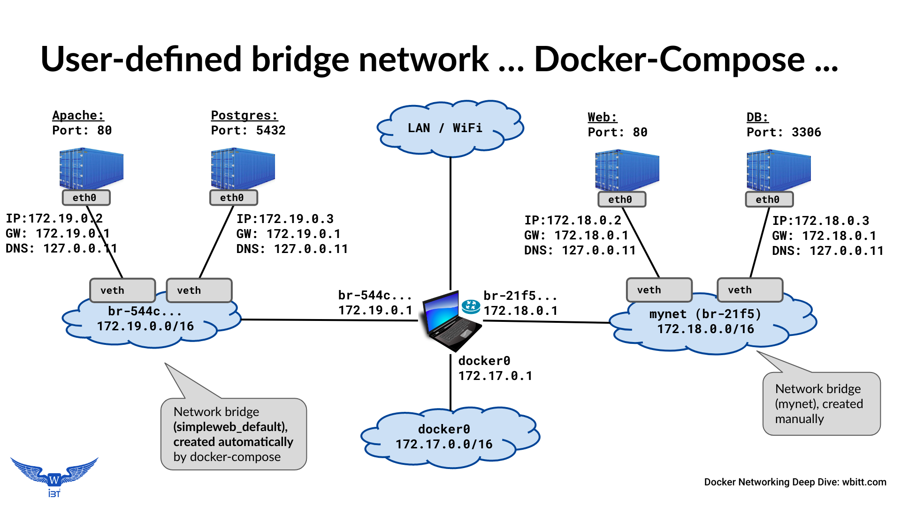 |
| ----------------------------------------------------------------------------------------------------- |

## Other aspects of bridge networks:
### No service discovery and no communication b/w "different" bridge networks:
In case there are multiple docker networks on the same computer, containers from one network do not know about containers on the other network, nor can they talk to them. This is a good thing to have for security reasons.

Here is how it is investigated:
```
dockerhost ~]$ docker exec -it simpleweb_apache_1 /bin/sh

/usr/local/apache2 # ping postgres
PING postgres (172.19.0.3): 56 data bytes
64 bytes from 172.19.0.3: seq=0 ttl=64 time=0.188 ms

/usr/local/apache2 # ping db
ping: bad address 'db'

/usr/local/apache2 # ping 172.18.0.2
PING 172.18.0.2 (172.18.0.2): 56 data bytes
2 packets transmitted, 0 packets received, 100% packet loss

/usr/local/apache2 # ping 172.18.0.1
PING 172.18.0.1 (172.18.0.1): 56 data bytes
64 bytes from 172.18.0.1: seq=0 ttl=64 time=0.105 ms
```
Notice, containers of one bridge network are not able to resolve names of containers on the other docker networks, and unable to talk to containers on other docker networks - which is *Good!*

Same applies for the containers on the *other* network:
```
dockerhost]$ docker exec -it web /bin/sh

/ # ping db
PING db (172.18.0.3) 56(84) bytes of data.
64 bytes from db.mynet (172.18.0.3): icmp_seq=1 ttl=64 time=0.085 ms

/ # ping postgres
ping: postgres: Name does not resolve

/ # ping 172.19.0.3
PING 172.19.0.3 (172.19.0.3) 56(84) bytes of data.
1 packets transmitted, 0 received, 100% packet loss, time 0ms

/ # ping 172.19.0.1
PING 172.19.0.1 (172.19.0.1) 56(84) bytes of data.
64 bytes from 172.19.0.1: icmp_seq=1 ttl=64 time=0.081 ms
``` 

### Accessibility from host computer:
All containers on any docker (bridge) network, are accessible from the host on the network layer. Below, we can see that our host computer can access containers from two different bridge networks.
```
dockerhost]$ ping 172.18.0.2
PING 172.18.0.2 (172.18.0.2) 56(84) bytes of data.
64 bytes from 172.18.0.2: icmp_seq=1 ttl=64 time=0.060 ms

dockerhost]$ ping 172.19.0.3
PING 172.19.0.3 (172.19.0.3) 56(84) bytes of data.
64 bytes from 172.19.0.3: icmp_seq=1 ttl=64 time=0.142 ms

dockerhost]$ curl 172.18.0.2
<title>Welcome to nginx!</title>

dockerhost]$ curl 172.19.0.2
<html><body><h1>It works!</h1></body></html>
```

## The Docker "Host" network:

| 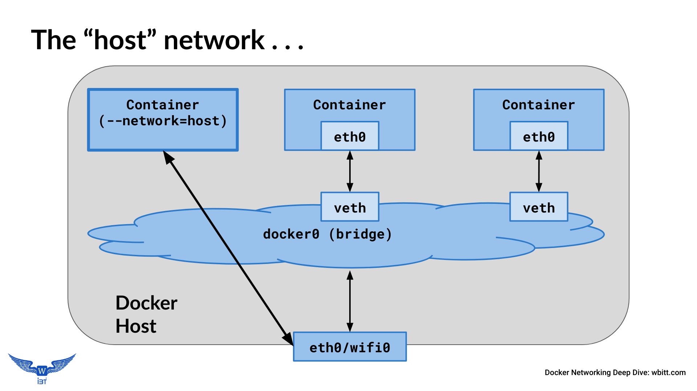 |
| ----------------------------------------------------------------- |

* The container shares the host’s *networking namespace*
* Container’s network stack is not isolated from the Docker host
* No `veth` pairs are created on host. All network interfaces of the host are visible inside the container.
* All routing of host computer is visible inside the container.
* No IP address is allocated to the container, it shares it with the host.
* Port-mapping does not take effect.  “-p”, and  “-P” options are ignored. Whatever the port of the application inside the container, it is available as-is on the host’s IP address.
* Useful to optimize performance, as it does not require NAT between host and container. No “userland-proxy” is created for each port of the container.
* Host networking only works on Linux hosts

Here is how containers on the host network look like:
```
dockerhost ~]$ docker run --name multitool --network host \
                 -d praqma/network-multitool

dockerhost ~]$ docker ps
CONTAINER ID  IMAGE                    COMMAND     CREATED        STATUS        PORTS   NAMES
dc61439f5546  praqma/network-multitool "nginx ..." 1 minute ago   Up 37 seconds         multitool

dockerhost ~]$ docker exec -it multitool /bin/sh
/ # ip addr show
1: lo: <LOOPBACK,UP,LOWER_UP> mtu 65536 state UNKNOWN group default qlen 1000
    link/loopback 00:00:00:00:00:00 brd 00:00:00:00:00:00
    inet 127.0.0.1/8 scope host lo
       valid_lft forever preferred_lft forever
2: wlp2s0: <BROADCAST,MULTICAST,UP,LOWER_UP> mtu 1500 state UP group default qlen 1000
    link/ether 34:f3:9a:27:e7:2d brd ff:ff:ff:ff:ff:ff
    inet 192.168.0.14/24 brd 192.168.0.255 scope global dynamic noprefixroute wlp2s0
9: docker0: <NO-CARRIER,BROADCAST,MULTICAST,UP> mtu 1500 state DOWN group default 
    link/ether 02:42:d4:fa:e4:ea brd ff:ff:ff:ff:ff:ff
    inet 172.17.0.1/16 brd 172.17.255.255 scope global docker0
```

Inspect the container, and investigate it's networking.
```
dockerhost ~]$ docker container inspect nginx 
. . . 
            "Pid": 2905,
. . . 
        "Name": "/nginx",
. . . 
            "NetworkMode": "host",
. . . 
            "ExposedPorts": {
                "80/tcp": {}
. . . 
            "Networks": {
                "host": {
. . . 
                    "IPAddress": "",
. . . 
                    "MacAddress": "",
```

```
dockerhost ~]# netstat -ntlp
Active Internet connections (only servers)
Proto Recv-Q Send-Q Local Address Foreign Address   State       PID/Program
. . . 
tcp        0      0 127.0.0.1:631 0.0.0.0:*         LISTEN      1131/cupsd
tcp        0      0 0.0.0.0:80    0.0.0.0:*         LISTEN      2905/nginx
tcp        0      0 0.0.0.0:443   0.0.0.0:*         LISTEN      2905/nginx

dockerhost ~]$ curl localhost
Praqma Network MultiTool (with NGINX) - kworkhorse.home.wbitt.com -  
```
**Notes:**
* The multitool container's *entrypoint* script is responsible to create the above web-page with container's IP in it. Since the container does not have any network interfaces of it’s own, the script did not find any IP address for it, and left the IP address empty in the generated web-page. That is why there is no IP address in the output of the `curl` command above!
* Since the container is using host’s network, it’s services are accessible directly on host computer, using `localhost` and on the network IP address of the host connected to LAN/wifi.

## The "None" network:

| 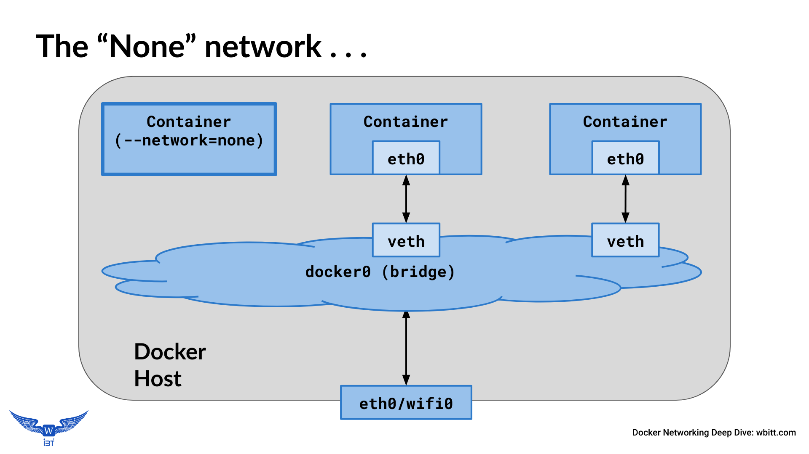 |
| ----------------------------------------------------------------- |


* The container networking is completely disabled. No IP, No egress & no ingress traffic.
* Only loopback device is available
* No `veth` pairs are created on host.
* Port-mapping does not take effect.  “-p”, and  “-P” options are ignored. 
* Used as a security sandbox, to test something in complete isolation.

Lets run a container by connecting it to the "none" network:
```
dockerhost ~]$ docker run --name multitool \
                --network none \
                -p 80:80 \
                -d praqma/network-multitool

dockerhost ~]$ docker ps
CONTAINER ID  IMAGE   COMMAND     CREATED     STATUS    PORTS   NAMES
6f0637d31ebe  nginx   “nginx …”   2 min ago   Up 2 min          multitool

dockerhost ~]$ docker exec -it multitool /bin/bash
bash-5.0# ifconfig -a
lo        Link encap:Local Loopback  
          inet addr:127.0.0.1  Mask:255.0.0.0
          UP LOOPBACK RUNNING  MTU:65536  Metric:1

bash-5.0# route -n
Kernel IP routing table
Destination     Gateway         Genmask         Flags Metric Ref    Use Iface
bash-5.0# 
```
Notice that passing `-p 80:80` has no effect. Also notice there are no network interfaces in the container, and no routing table.

------
# Join one container to another container
Most of the times, the containers are very limited in terms of how much software/tools are inside them. This is done to keep their size small, and also for security reasons. However, troubleshooting them becomes very difficult, as they don't have enough tools in them. There is a possibility to join a *tools* container to a *main* container. 

Examples of such limited containers are: `nginx`, `mysql`, etc, or images built from `scratch`. 
Examples of tools containers are: `busybox`, `alpine`, `praqma/network-multitool` , etc.

## Join one container to another container’s network namespace:

| 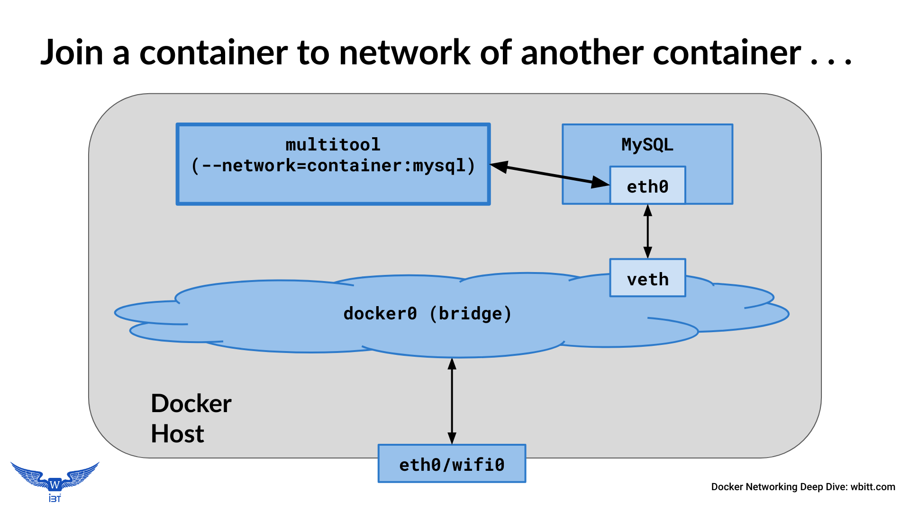 |
| ----------------------------------------------------------------------- |

* The container being joined does not have an IP of it’s own. It joins the IP/network namespace of the main container.
* No extra `veth` interfaces are created on the host for the joining container. 
* The container being joined is not able to see the processes of the main container.


Lets run a typical `mysql` container, which does not have any troubleshooting tools inside it. Investigate the container, using network and process management tools:

```
dockerhost ~]$ docker run --name mysql -e MYSQL_ROOT_PASSWORD=secret -d mysql

dockerhost ~]$ docker ps
CONTAINER ID  IMAGE   COMMAND      CREATED    STATUS     PORTS     NAMES
e53613c1ebe1  mysql   "docker …"   1 min ago  UP 1 min   3306/tcp  mysql

dockerhost ~]$ docker exec -it mysql /bin/sh

# ifconfig
/bin/sh: 2: ifconfig: not found

# ping 8.8.8.8
/bin/sh: 3: ping: not found

# ps aux
/bin/sh: 4: ps: not found
```

Alright, lets attach a *tools* container to this container for troubleshooting:

```
dockerhost ~]$ docker run --name busybox \
                 --network container:mysql \
                 --rm -it busybox /bin/sh

/ # ip addr show
. . . 
46: eth0@if47: <...UP,LOWER_UP> ... qdisc noqueue state UP 
      link/ether 02:42:ac:11:00:02 brd ff:ff:ff:ff:ff:ff link-netnsid 0
      inet 172.17.0.2/16 brd 172.17.255.255 scope global eth0

/ # netstat -ntlp
Active Internet connections (only servers)
Proto Recv-Q Send-Q Local Address	Foreign Address	State	PID/Program    
tcp6       0      0 :::3306       :::*          	LISTEN	-                   

/ # ping 8.8.8.8
64 bytes from 8.8.8.8: icmp_seq=1 ttl=54 time=17.4 ms
```

Investigate how do things look from Docker’s perspective:
```
dockerhost ~]$ docker ps
CONTAINER ID  IMAGE     COMMAND     CREATED     STATUS     PORTS      NAMES
e53613c1ebe1  mysql     "docker …"  15 min ago  UP 15 min  3306/tcp   mysql
2acc045dc3cd  busybox   "/docker …" 12 min ago  Up 12 min             busybox

dockerhost ~]$ docker inspect mysql
    . . . 
    "NetworkMode": "default",
    . . . 
        "IPAddress": "172.17.0.2",
        "MacAddress": "02:42:ac:11:00:02",
dockerhost ~]$ docker inspect busybox
    . . . 
    "NetworkMode": "container:e53613c1ebe1",
    . . . 
        "IPAddress": "",
        "MacAddress": "",
```
Notice that the tools container does not have an IP address.

Now, when a container is joined to another contianer's network namespace, can we also see processes inside the other container? Unfortunately, not. Joining a container’s network does not help if we want to run process troubleshooting tools, such as `ps`, `strace`, `gdb`, etc, on the processes in the main container, because the processes from the main container are not visible to the tools container.

```
dockerhost ~]$ docker run --name busybox \
               --network container:mysql \
               --rm -it busybox /bin/sh

/ # ps aux
PID   USER     TIME  COMMAND
    1 root      0:00 /bin/sh
    6 root      0:00 ps aux
/ # 
```
Notice, we are inside the `busybox` container, and there is no `mysql` process visible.

## Join a container to process-namespace of another container
To be able to manage the processes of the main container, the tools container should be connected to the process namespace of the main container.

| 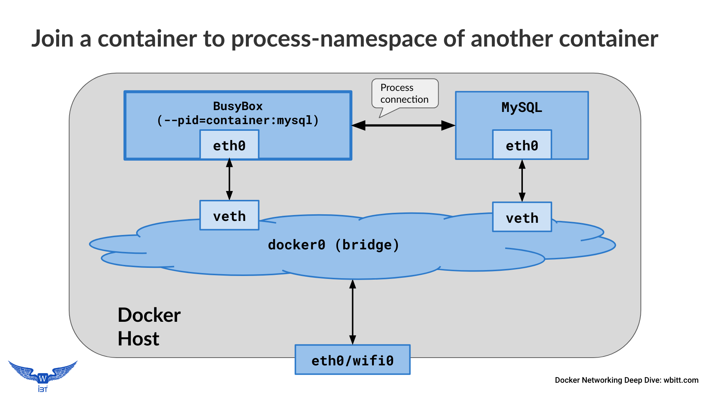 |
| ----------------------------------------------------------------------- |


To look at the processes of the main `mysql` container, make the `busybox` container join the *process-namespace* of the `mysql` container, using: `--pid container:<MainContainerID>` 

```
dockerhost ~]$ docker run --name busybox \
                 --pid container:mysql \
                 --rm -it busybox /bin/sh

/ # ps aux
PID   USER     TIME  COMMAND
    1 999       0:25 mysqld
  505 root      0:00 /bin/sh
  510 root      0:00 ps aux
/ # 
```
Notice that we are inside the `busybox` container, and now we see `mysql` process as well!

Remember, when run this way, the joining container gets its own network stack, different from the network stack of main container it is joined with. Here is how it looks like:

```
/ # ip addr show
1: lo: <LOOPBACK,UP,LOWER_UP> mtu 65536 qdisc noqueue qlen 1000
    inet 127.0.0.1/8 scope host lo
. . . 
48: eth0@if49: <...UP,LOWER_UP,M-DOWN> mtu 1500 qdisc noqueue 
    inet 172.17.0.3/16 brd 172.17.255.255 scope global eth0
```
Notice the IP of mysql container is `172.17.0.2`, which is different from the one in the `busybox` container shown here.

## Join the network and process namespace of the main container in single step!
We can actually join a *tools* container to both network and process namespaces of the main container. That way, we can manage / work with both the networking and the process-management of the main container.

| 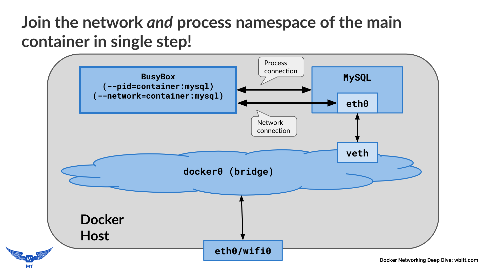 |
| --------------------------------------------------------------------------------------- |

Here is how it works:
```
dockerhost ~]$ docker run --name busybox \
                 --network container:mysql \
                 --pid container:mysql \
                 --rm -it busybox /bin/sh

/ # ip addr show
. . . 
48: eth0@if47: <...UP,LOWER_UP,M-DOWN> mtu 1500 qdisc noqueue 
link/ether 02:42:ac:11:00:02 brd ff:ff:ff:ff:ff:ff
    inet 172.17.0.2/16 brd 172.17.255.255 scope global eth0

/ # ps aux
PID   USER     TIME  COMMAND
    1 999       0:33 mysqld
  513 root      0:00 /bin/sh
  518 root      0:00 ps aux
```
Notice the IP & MAC of `mysql` container, and processes from both containers - all visible in the `busybox` container!

