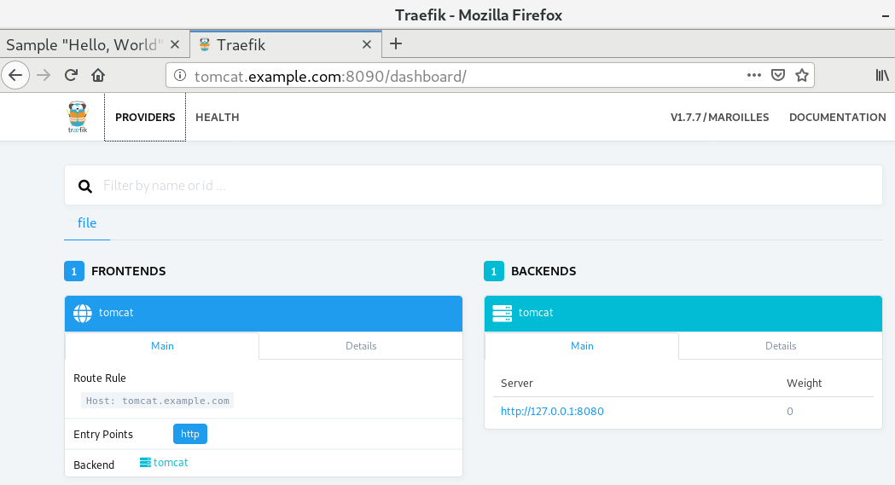
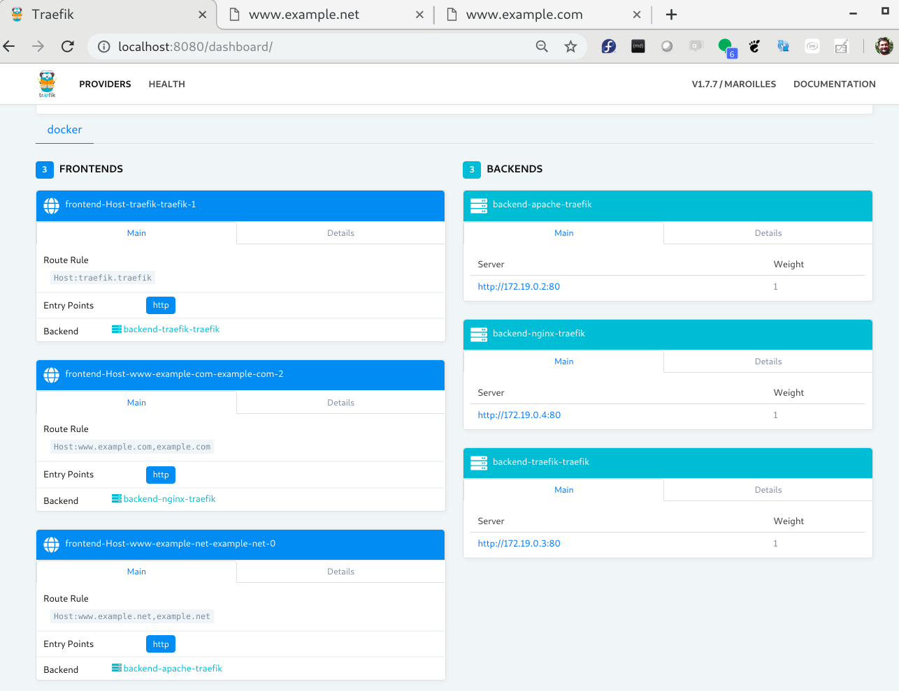
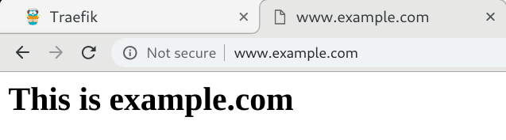
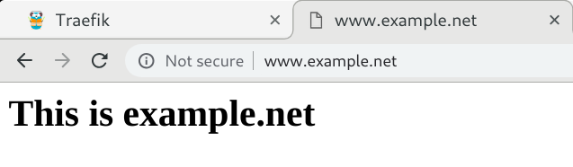
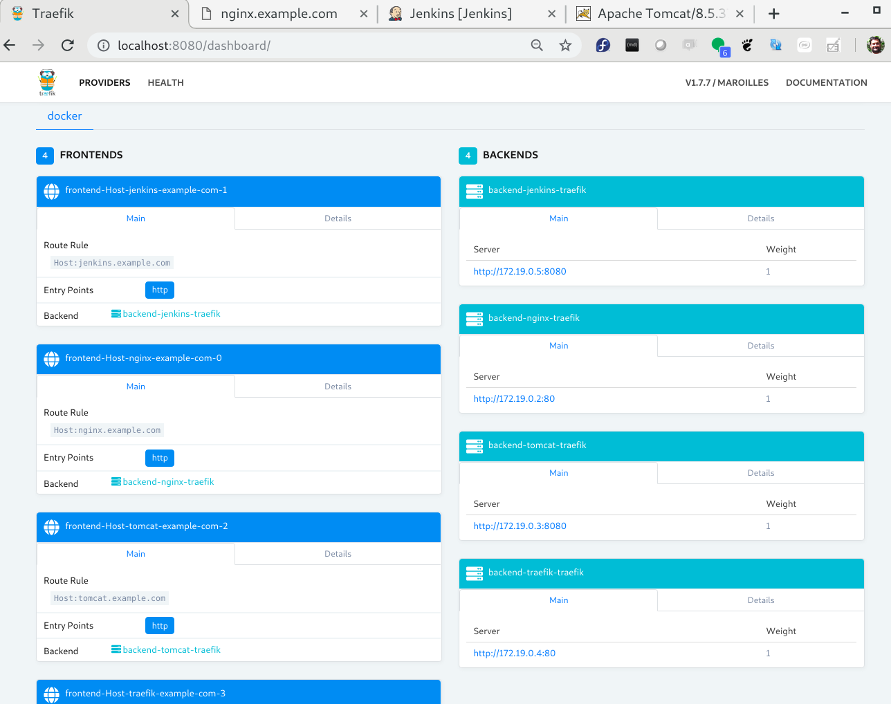
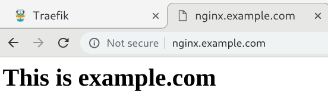
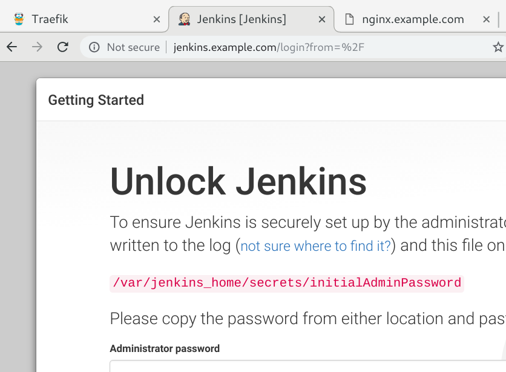
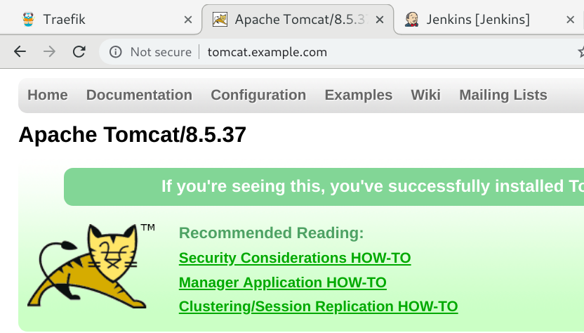

# Traefik made easy

In this guide, I will show various ways traefik can be used as a reverse proxy for your (back-end) systemd services and containers, on Docker (compose) and Kubernetes.


## Docker / Docker-compose:
For clear docker examples, please see `example*` directories under the `traefik` directory.

Topics covered are:
* Basic setup:
* Simple setup without traefik config file
* Setup with Traefik config file
* Routing Rules / Frontend rules, with correct host route rules
* exposebyDefault true/false
* Dashboard protection with password
* SSL with self signed (wild-card) certificate
* SSL with public/valid (wild-card) certificates, using letsencrypt, with DNS challenge


------
Ignore anything below this line - for now. This needs re-arrangement.


* Traefik running as a service, working as reverse proxy for tomcat:8080, jenkins:8080
 * SSL with self signed certificates in traefik instead of tomcat
 * script to create self signed certs
* Traefik running in docker-compose with tomcat:8080, and jenkins:8080
* Traefik running as reverse proxy for two different websites www.example.com, www.example.net,

**References:**
* https://docs.traefik.io/basics/
* https://docs.traefik.io/user-guide/examples/
* https://www.digitalocean.com/community/tutorials/how-to-use-traefik-as-a-reverse-proxy-for-docker-containers-on-ubuntu-18-04
* https://www.digitalocean.com/community/tutorials/how-to-use-traefik-as-a-reverse-proxy-for-docker-containers-on-ubuntu-18-04
* https://medium.com/@geraldcroes/kubernetes-traefik-101-when-simplicity-matters-957eeede2cf8
* 
* https://medium.com/@xavier.priour/secure-traefik-dashboard-with-https-and-password-in-docker-5b657e2aa15f


# VM setup:
Traefik and it's backends will be running as systemd services.

## Traefik in front of Tomcat / Jenkins:
In this guide, I will show traefik in-front of tomcat only.

First, install Tomcat. 
```
[root@centos7 ~]# yum -y install tomcat
```

**Note:** Both tomcat and jenkins use port 8080, so they cannot run at the same time, unless you change the listening port of one of them, then you can run both.

```
[root@centos7 ~]# systemctl start tomcat

[root@centos7 ~]# systemctl status tomcat
● tomcat.service - Apache Tomcat Web Application Container
   Loaded: loaded (/usr/lib/systemd/system/tomcat.service; disabled; vendor preset: disabled)
   Active: active (running) since Sun 2019-01-20 09:40:45 EST; 5s ago
 Main PID: 3402 (java)
   CGroup: /system.slice/tomcat.service
           └─3402 /usr/lib/jvm/jre/bin/java -classpath /usr/share/tomcat/bin/bootstrap.jar:/usr/share/tomcat/bin/tomcat-juli.jar:/usr...

Jan 20 09:40:46 centos7 server[3402]: Jan 20, 2019 9:40:46 AM org.apache.catalina.core.StandardService startInternal
Jan 20 09:40:46 centos7 server[3402]: INFO: Starting service Catalina
Jan 20 09:40:46 centos7 server[3402]: Jan 20, 2019 9:40:46 AM org.apache.catalina.core.StandardEngine startInternal
Jan 20 09:40:46 centos7 server[3402]: INFO: Starting Servlet Engine: Apache Tomcat/7.0.76
Jan 20 09:40:46 centos7 server[3402]: Jan 20, 2019 9:40:46 AM org.apache.coyote.AbstractProtocol start
Jan 20 09:40:46 centos7 server[3402]: INFO: Starting ProtocolHandler ["http-bio-8080"]
Jan 20 09:40:46 centos7 server[3402]: Jan 20, 2019 9:40:46 AM org.apache.coyote.AbstractProtocol start
Jan 20 09:40:46 centos7 server[3402]: INFO: Starting ProtocolHandler ["ajp-bio-8009"]
Jan 20 09:40:46 centos7 server[3402]: Jan 20, 2019 9:40:46 AM org.apache.catalina.startup.Catalina start
Jan 20 09:40:46 centos7 server[3402]: INFO: Server startup in 92 ms
[root@centos7 ~]# 

[root@centos7 ~]# netstat -ntlp
Active Internet connections (only servers)
Proto Recv-Q Send-Q Local Address           Foreign Address         State       PID/Program name    
tcp        0      0 0.0.0.0:22              0.0.0.0:*               LISTEN      3150/sshd           
tcp        0      0 127.0.0.1:25            0.0.0.0:*               LISTEN      3256/master         
tcp6       0      0 :::8009                 :::*                    LISTEN      3402/java           
tcp6       0      0 :::8080                 :::*                    LISTEN      3402/java           
tcp6       0      0 :::22                   :::*                    LISTEN      3150/sshd           
tcp6       0      0 ::1:25                  :::*                    LISTEN      3256/master         
tcp6       0      0 127.0.0.1:8005          :::*                    LISTEN      3402/java           
[root@centos7 ~]# 
```

Make sure firewall allows ports 80,443 and 8080, 8090; or disable firewall completely - on a test system.


Download a sample war file and place it in tomcat, so you have something to see! :)
```
[root@centos7 ~]# curl -LO https://tomcat.apache.org/tomcat-7.0-doc/appdev/sample/sample.war

[root@centos7 ~]# cp sample.war /usr/share/tomcat/webapps/
```


Set a name for this vm in /etc/hosts, say tomcat.example.com , on host computer. Or, setup DNS properly.
```
[root@kworkhorse ~]# vi /etc/hosts
127.0.0.1   	localhost localhost.localdomain

# traefik Example
192.168.122.3   tomcat.example.com
```


Download the latest version of traffic from: [https://github.com/containous/traefik/releases](https://github.com/containous/traefik/releases) . It is a single binary file, so just download and place it in `/usr/local/bin/` or somewhere else you like. It is about 60-70 MB in size.

```
[root@centos7 ~]# curl -LO https://github.com/containous/traefik/releases/download/v1.7.7/traefik_linux-amd64
[root@centos7 ~]# chmod +x traefik_linux-amd64 
[root@centos7 ~]# cp traefik_linux-amd64 /usr/local/bin/traefik
```

Download the sample traefik config file from: [https://raw.githubusercontent.com/containous/traefik/master/traefik.sample.toml](https://raw.githubusercontent.com/containous/traefik/master/traefik.sample.toml), and place in it `/usr/local/etc/` .

```
[root@centos7 ~]# curl -LO https://raw.githubusercontent.com/containous/traefik/master/traefik.sample.toml
[root@centos7 ~]# cp traefik.sample.toml /usr/local/etc/traefik.toml
```

Adjust the traefik config file:
```
[root@centos7 ~]# cat /usr/local/etc/traefik.toml
[entryPoints]
    [entryPoints.http]
    address = ":80"
    [entryPoints.dashboard]
    address = ":8090"
      [entryPoints.dashboard.auth.basic]
      users = ["admin:$2y$08$64hQda74gXS80mS63hN3xOFGVB9KA2vUOXtW.NDaBjX9pEHq7qdUa"]
[api]
  dashboard = true
  entryPoint = "dashboard"
[ping]
  entrypoint = "dashboard"

[file]
  [frontends]
    [frontends.tomcat]
    backend = "tomcat"
      [frontends.tomcat.routes.rule1]
      rule = "Host: tomcat.example.com"
  [backends]
    [backends.tomcat]
      [backends.tomcat.servers.server1]
      url = "http://127.0.0.1:8080"

[root@centos7 ~]# 
```

Since we have tomcat running on the same VM on port 8080, we can't run traefik's dashboard on 8080. So we change it to 8090, or any other port of your desire.

Also, since this is a plain VM, we need to setup frontend and backend so traefik would know how to flow traffic. The special "file" directive is used for that. We can also setup traffic to watch an external rules file which contains the frontends and beckends routing. Of-course none of this is needed (normally) if traefik is talking to docker or kubernetes API. In our case in this particular example, we have neither docker, nor kubernetes - just plain simple VM.


Create a systemd service file for Traefik. Not entirely necessary though.
```
[root@centos7 ~]# vi traefik.service

[Unit]
Description=Traefik reverse proxy / edge router

[Service]
Type=simple
ExecStart=/usr/local/bin/traefik  --configFile=/usr/local/etc/traefik.toml


[Install]
WantedBy=multi-user.target
```

Enable and start the traefik service:
```
[root@centos7 ~]# cp traefik.service /etc/systemd/system/

[root@centos7 ~]# systemctl daemon-reload

[root@centos7 ~]# systemctl restart traefik

[root@centos7 ~]# systemctl status -l traefik
● traefik.service - Traefik reverse proxy / edge router
   Loaded: loaded (/etc/systemd/system/traefik.service; disabled; vendor preset: disabled)
   Active: active (running) since Sun 2019-01-20 17:01:02 EST; 1s ago
 Main PID: 11566 (traefik)
   CGroup: /system.slice/traefik.service
           └─11566 /usr/local/bin/traefik --configFile=/usr/local/etc/traefik.toml

Jan 20 17:01:02 centos7 systemd[1]: Stopped Traefik reverse proxy / edge router.
Jan 20 17:01:02 centos7 systemd[1]: Started Traefik reverse proxy / edge router.
[root@centos7 ~]#
```


Two Screenshots , one with traffic dashboard, and the other with tomcat without 8080:




## Basic Authentication:

It is important to secure the dashboard with some authentication. Passwords can be encoded in MD5, SHA1 and BCrypt: you can use htpasswd to generate them. Users can be specified directly in the TOML file, or indirectly by referencing an external file; if both are provided, the two are merged, with external file contents having precedence.

```
  [entryPoints.dashboard.auth.basic]
    users = ["admin:$2y$08$64hQda74gXS80mS63hN3xOFGVB9KA2vUOXtW.NDaBjX9pEHq7qdUa"]
```

Generate the password using htpasswd utility - part of httpd-tools package on CENTOS:
```
[root@centos7 ~]# htpasswd -B -C 8 -n admin
New password: 
Re-type new password: 
admin:$2y$08$64hQda74gXS80mS63hN3xOFGVB9KA2vUOXtW.NDaBjX9pEHq7qdUa

[root@centos7 ~]# 
```
**Notes:** 
* -B = use Bcrypt (Secure)
* -C = BCrypt compute time / difficulty level (4-31)
* -n = username
* password = secret


Here is screenshot with Authentication dialogue:


# Docker-compose:
In docker compose, I will discuss two scenarios.

* Two different web servers, serving two different websites / domains. This requires modifying traefik configuration at run time using certain labels from within docker-compose file.
* Two (or more) different services, running on different ports but part of same domain. e.g. apache, jenkins, artifactory, jira, confluence within a single orgaization.


## Setup-1: Traefik in front of two web-servers serving two different websites
Setup:
* Traefik
* NGINX
* Apache

```
[kamran@kworkhorse traefik]$ docker-compose up -d
Creating traefik_nginx_1   ... done
Creating traefik_traefik_1 ... done
Creating traefik_apache_1  ... done
[kamran@kworkhorse traefik]$
```


```
[kamran@kworkhorse traefik]$ docker-compose ps
      Name                 Command           State                                Ports                              
---------------------------------------------------------------------------------------------------------------------
traefik_apache_1    httpd-foreground         Up      80/tcp                                                          
traefik_nginx_1     nginx -g daemon off;     Up      80/tcp                                                          
traefik_traefik_1   /entrypoint.sh traefik   Up      0.0.0.0:443->443/tcp, 0.0.0.0:80->80/tcp, 0.0.0.0:8080->8080/tcp
[kamran@kworkhorse traefik]$
```









## Setup-2: Traefik in front of multiple backend services, same domain
Setup:
* Traefik
* NGINX
* Tomcat
* jenkins:alpine

```
[kamran@kworkhorse traefik]$ docker-compose -f docker-compose-setup-2.yml  up -d
Starting traefik_tomcat_1  ... done
Starting traefik_nginx_1   ... done
Starting traefik_jenkins_1 ... done
Starting traefik_traefik_1 ... done
[kamran@kworkhorse traefik]$
```


```
[kamran@kworkhorse traefik]$ docker-compose -f docker-compose-setup-2.yml  ps
      Name                     Command               State                                Ports                              
-----------------------------------------------------------------------------------------------------------------------------
traefik_jenkins_1   /bin/tini -- /usr/local/bi ...   Up      50000/tcp, 8080/tcp                                             
traefik_nginx_1     nginx -g daemon off;             Up      80/tcp                                                          
traefik_tomcat_1    catalina.sh run                  Up      8080/tcp                                                        
traefik_traefik_1   /entrypoint.sh traefik           Up      0.0.0.0:443->443/tcp, 0.0.0.0:80->80/tcp, 0.0.0.0:8080->8080/tcp
[kamran@kworkhorse traefik]$ 
```







